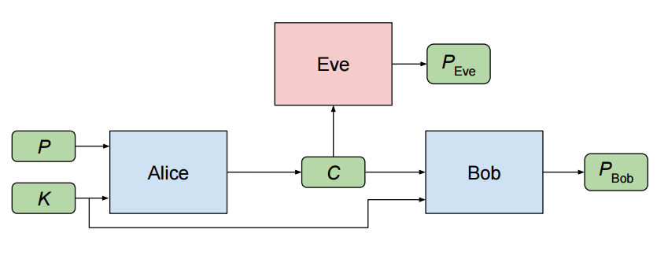
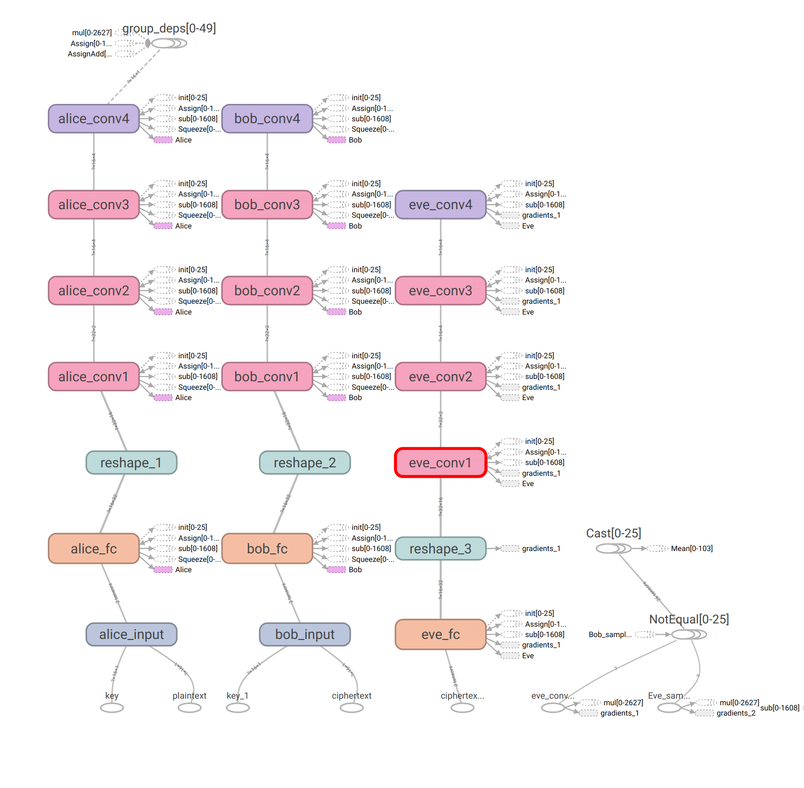
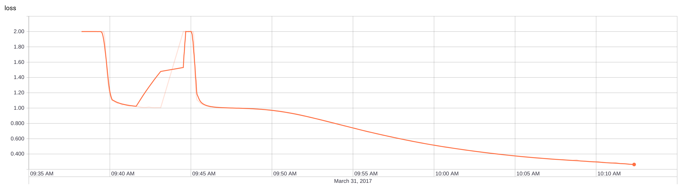

# KERAS-DCGAN

Example implementations of adversarial agents with keras.

## Example 1 - generating artificial images

In this example we learn:
- how to generate believable looking MNIST digit images
- how to classify MNIST digits

The agents that learn this don't see the raw MNIST image data at all! Rather 
knowledge is transferred from an adversarial discriminator which is trying to
spot the difference between _fake_ generated images and the real thing.


We train three adversarial deep learning models - one for each agent.

## Agents:

- A **generator** which takes a random signal + a digit class. The generator model 
  tries to produce images that look real, get correctly classified by the classifier,
  and get a high score from the discriminator.
- A **discriminator** which is given images and has to decide if they are fake or not. 
  The discriminator model is the only thing exposed to the real MNIST training images.
  Ideally after a long time the discriminator's loss rises.
- A **classifier** which is given _generated_ images and learns a very standard MNIST
  multiclass classification model that outputs the digit class of the image (0 - 9).


## Usage


**Training:**

```
python dcgan.py --mode train --batch-size <batch_size>

$ python dcgan.py --mode train --path ~/generated-images --batch_size 256
```


**Image generation:**

```
python dcgan.py --mode generate --batch-size <batch_size>

$ python dcgan.py --mode generate --batch-size 64 --nice` : top 5% images according to discriminator

$ python dcgan.py --mode generate --batch-size 128
```


## Result


**generated images :** 


 


**train process :**


## Acknowledgments

Based on [jacobgil](https://github.com/jacobgil/keras-dcgan)'s implementation of 
[Unsupervised Representation Learning with Deep Convolutional Generative Adversarial Networks](http://arxiv.org/abs/1511.06434).

High level changes from that repository:

- Adds a third agent which classifies generated digits
- Generator given an input class as well as random IV

## Example 2 - Adversarial Cryptography

An implementation of
[Learning to Protect Communications with Adversarial Neural Cryptography](https://arxiv.org/abs/1610.06918)
using keras.

Essentially three parties are trying to carry out a very classic cryptography problem. *Alice* and *Bob* have a
shared key and which to communicate a message *P* without *Eve* being able to reconstruct the message.


Diagram from: [nlml.github.io](https://nlml.github.io/neural-networks/adversarial-neural-cryptography/)

### Model:

You can render a nice viz of the models' nodes using Tensorboard:



### Training:





### Notes:

I wasn't sure exactly how do do the custom loss function for alice using Keras.

