# Steganography GAN experiment

Message size: Started with 4 bits
Cover size: 28 x 28 x 1 MNIST dataset

To validate the individual models were somewhat up to the task I ran two preliminaries:

*Preliminary 1*:  A GAN with Alice and the Discriminator should learn to generate perfect images.

*Preliminary 2*: A GAN with Alice and Bob with no discriminator should learn to perfectly communicate.

I also ran some of these with CIFAR10 which just adds an image depth of 3
instead of MNIST's greyscale images. As I wasn't getting great results on
the faster to run models I've not included them.

## Experiments

### Experiment 1

Trained without Bob for 2 epochs.
Images looked good, but after 45 epochs no 
information transfer to Bob.

## Experiment 2

Train Bob for 1 extra Epoch.

Adjust system so that Alice and Bob adjust together when evaluating the Alice2Bob loss.

Example output on top, cover image on bottom:

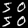

    4 Step 99. 50 Discriminator: 0.064867 Bob: 0.002685 Alice2Bob: 0.000557 Alice fooling Discriminator: 4.394429
    8 Step 99. 50 Discriminator: 0.005728 Bob: 0.002625 Alice2Bob: 0.006086 Alice fooling Discriminator: 4.791522

So they communicate well, but the discriminator can always tell real from fake.

## Experiment 3

`alice_and_eve_gan` now has larger learning rate optimizer
    
    4 Step 19. 40 Discriminator: 8.059048 Bob: 0.056430 Alice2Bob: 0.056852 Alice fooling Discriminator: 0.000000
    4 Step 19. 50 Discriminator: 8.059048 Bob: 0.059923 Alice2Bob: 0.059400 Alice fooling Discriminator: 0.000000

Seemed to fail - discriminator couldn't tell real from fake despite clear visual differences.

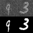

## Experiment 4

Deeper discriminator network. Ran over night with larger messages size.

#### 4 bit message:

    4 Step 199. 80 Discriminator: 8.059048 Bob: 1.010742 Alice2Bob: 1.010742 Alice fooling Discriminator: 0.000000
    4 Step 199. 90 Discriminator: 8.059048 Bob: 0.995117 Alice2Bob: 0.995117 Alice fooling Discriminator: 0.000000
    4 Step 199.100 Discriminator: 8.059048 Bob: 1.017578 Alice2Bob: 1.017578 Alice fooling Discriminator: 0.000000
    4 Step 199.110 Discriminator: 8.059048 Bob: 0.988281 Alice2Bob: 0.988281 Alice fooling Discriminator: 0.000000

Alice simply copied the cover image - no embedded message.

#### 16 Bits:
    16 Step 199. 90 Discriminator: 8.059048 Bob: 0.024411 Alice2Bob: 0.021986 Alice fooling Discriminator: 0.000000
    16 Step 199.100 Discriminator: 8.059048 Bob: 0.024700 Alice2Bob: 0.027933 Alice fooling Discriminator: 0.000000
    16 Step 199.110 Discriminator: 8.059048 Bob: 0.024143 Alice2Bob: 0.026122 Alice fooling Discriminator: 0.000000

Alice now just transfered the message with no attempt to replicate the cover image!

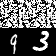

#### 32 Bits
    32 Step 199. 80 Discriminator: 0.558385 Bob: 0.728367 Alice2Bob: 0.734731 Alice fooling Discriminator: 0.641608
    32 Step 199. 90 Discriminator: 0.608782 Bob: 0.717652 Alice2Bob: 0.717429 Alice fooling Discriminator: 0.657954
    32 Step 199.100 Discriminator: 0.749136 Bob: 0.719004 Alice2Bob: 0.716547 Alice fooling Discriminator: 0.503441
    32 Step 199.110 Discriminator: 0.630117 Bob: 0.723086 Alice2Bob: 0.718750 Alice fooling Discriminator: 0.540900

An equilibrium was reached between trying to communicate the secret, and preserve the cover image.

Samples from epoch 5, 100, 200 show it wasn't getting better though:

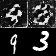
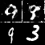
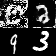

#### 64 bits

Alice learned how to fool the discriminator, but not by copying the cover image.
Some attempt at communicating between Alice and Bob.

    64 Step 68. 90 Discriminator: 8.059048 Bob: 0.600288 Alice2Bob: 0.594419 Alice fooling Discriminator: 0.000000
    64 Step 68.100 Discriminator: 8.059048 Bob: 0.600539 Alice2Bob: 0.596806 Alice fooling Discriminator: 0.000000
    64 Step 68.110 Discriminator: 8.059048 Bob: 0.594370 Alice2Bob: 0.590285 Alice fooling Discriminator: 0.000000

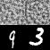

## Experiment 5

Try adding an additional output - the image class - to Bob.

    4 Step 102. 50 
        Discriminator: 8.059048 
        Bob: [0.0095783472, 0.0070426227, 0.0025357245] 
        Alice2Bob: [0.072187729, 0.0096556637, 0.062532067] 
        Alice fooling Discriminator: 0.000000

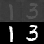

### Model Structure

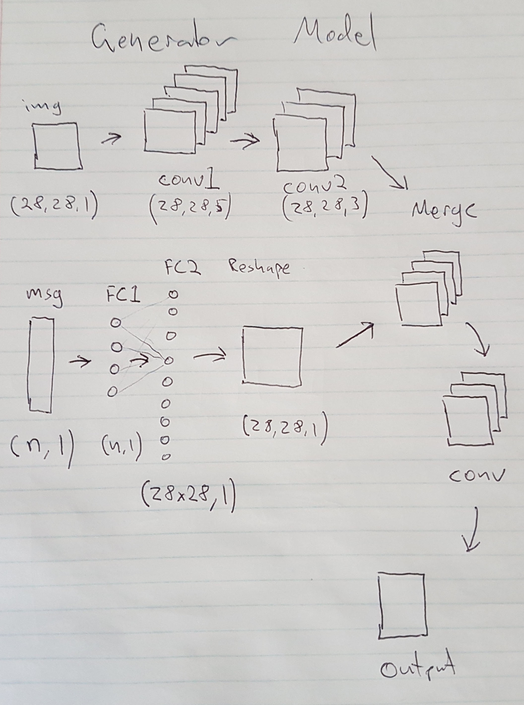

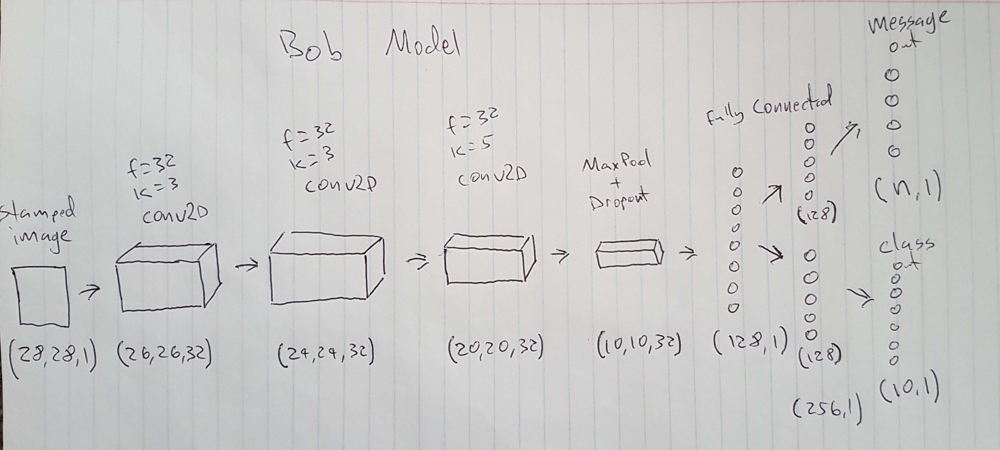

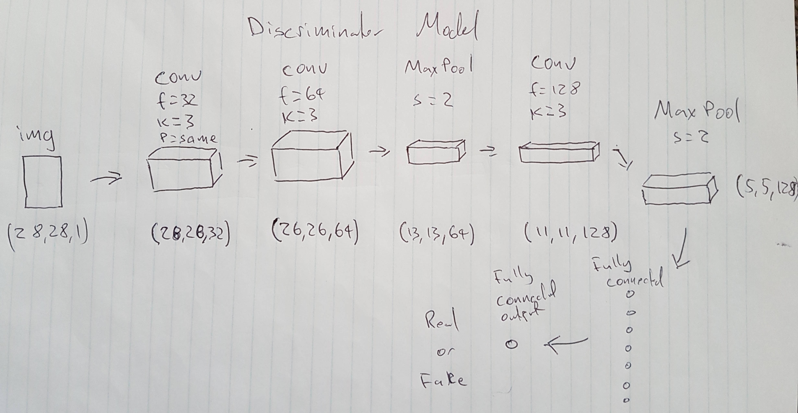

## Other Ideas

- Look into predicting the nash equilibrium - need better balancing 
- Add a shared key to Alice and Bob but not share it with Eve
- Add a random vector to the generator - Alice
- adding LSTM memory
